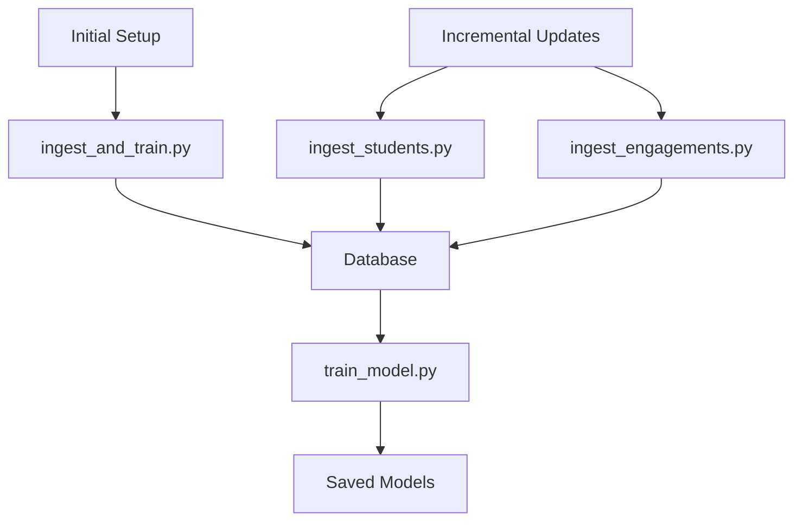

# Data Ingestion and Model Training Scripts

This directory contains scripts for data ingestion, model training, and incremental updates for the Student Engagement Recommender System.

## Data Flow Overview



## Scripts Overview

### Initial Setup
- **ingest_and_train.py**: One-time script for initial setup
  - Loads initial data from CSV files
  - Stores data in database
  - Trains initial recommendation models
  - Usage: `python ingest_and_train.py --students-csv data/students.csv --engagements-csv data/engagements.csv --content-csv data/content.csv`

### Incremental Updates
- **ingest_students.py**: Handles new/updated student data
  - Processes new students from CSV or database
  - Updates existing student information
  - Triggers model retraining if significant changes
  - Usage: `python ingest_students.py --students-csv data/new_students.csv` or `python ingest_students.py --days 7`

- **ingest_engagements.py**: Handles new engagement data
  - Processes new engagements from CSV or database
  - Updates student states based on engagements
  - Triggers model retraining if needed
  - Usage: `python ingest_engagements.py --engagements-csv data/new_engagements.csv` or `python ingest_engagements.py --days 7`

### Model Training
- **train_model.py**: Unified model training script
  - Supports multiple model types:
    - Hybrid (default)
    - Collaborative filtering
    - Content-based
  - Handles data preparation and model saving
  - Usage: `python train_model.py --model-type [hybrid|collaborative|content_based]`

## Directory Structure

```
models/
├── saved/
│   ├── checkpoints/     # Training checkpoints
│   ├── embeddings/      # Model embeddings
│   ├── model_weights/   # Model weight files
│   └── vocabularies/    # Vocabulary files
└── saved_models/
    ├── collaborative/   # Collaborative filtering models
    ├── content_based/   # Content-based models
    ├── hybrid/         # Hybrid recommendation models
    └── metadata/       # Model metadata and configurations
```

## Usage Examples

### Initial Setup
```bash
# Load initial data and train models
python ingest_and_train.py \
    --students-csv data/students.csv \
    --engagements-csv data/engagements.csv \
    --content-csv data/content.csv \
    --epochs 5
```

### Incremental Updates
```bash
# Update with new students
python ingest_students.py --students-csv data/new_students.csv

# Update with new engagements
python ingest_engagements.py --engagements-csv data/new_engagements.csv

# Update from database (last 7 days)
python ingest_students.py --days 7
python ingest_engagements.py --days 7
```

### Model Training
```bash
# Train hybrid model (default)
python train_model.py --model-type hybrid --epochs 5

# Train collaborative filtering model
python train_model.py --model-type collaborative --epochs 10

# Train content-based model
python train_model.py --model-type content_based
```

## Best Practices

1. **Initial Setup**
   - Run `ingest_and_train.py` first to set up the database and initial models
   - Ensure all required CSV files are properly formatted

2. **Incremental Updates**
   - Run `ingest_students.py` and `ingest_engagements.py` regularly (e.g., daily)
   - Monitor the number of changes to avoid unnecessary model retraining
   - Use appropriate thresholds for model retraining

3. **Model Training**
   - Use appropriate model type for your use case
   - Monitor training metrics and adjust hyperparameters as needed
   - Keep track of model versions and performance

## Error Handling

All scripts include:
- Input validation
- Database transaction management
- Error logging
- Graceful failure handling

## Logging

Logs are written to:
- Console output
- Application logs (if configured)
- Database (for tracking changes)

## Dependencies

- Python 3.8+
- pandas
- tensorflow
- sqlalchemy
- numpy
- scikit-learn 